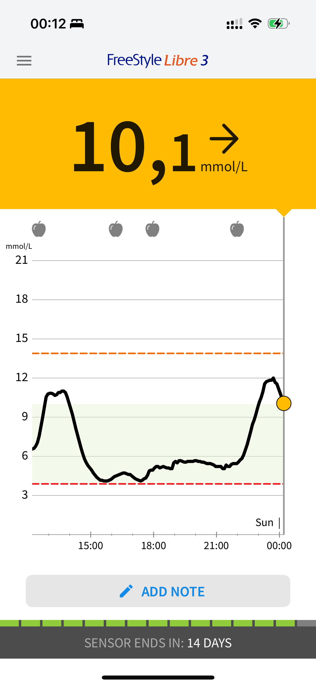
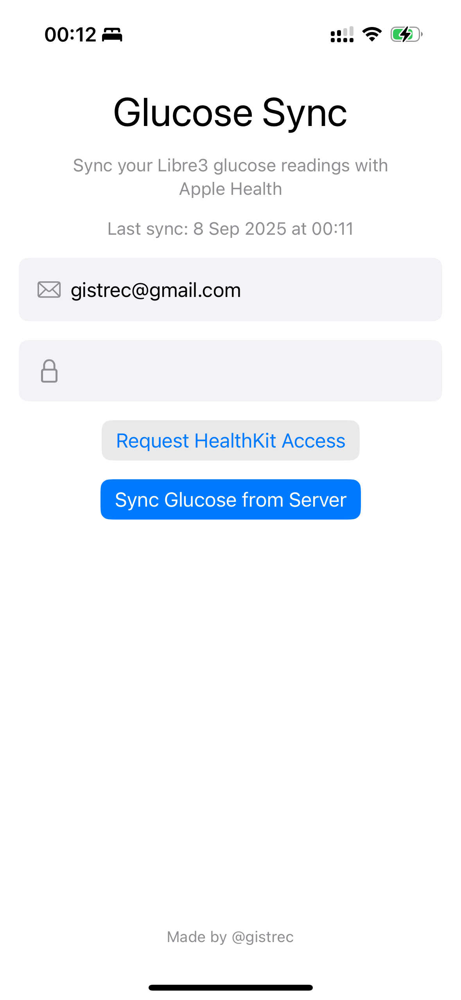
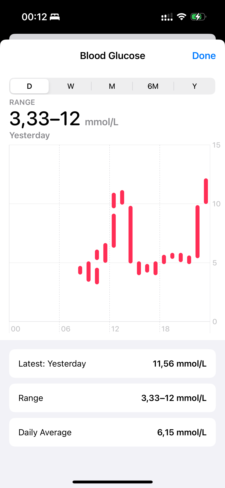

# GlucoseSync  
*Sync your Libre 3 glucose data into Apple Health*

GlucoseSync is a lightweight iOS app that transfers glucose readings from Abbott’s Libre 3 sensor into Apple Health, so your data can be used seamlessly in other health apps.  
The app is written in SwiftUI, talks only to Abbott’s official LibreView cloud and Apple HealthKit, and never sends information to any third-party server.

---

## 🔒 Privacy & Security
- No data ever leaves the user’s device.  
- The user’s credentials are saved only in the **system Keychain**.  
- The app communicates exclusively with:  
  - LibreView Cloud (`https://api-de.libreview.io`)  
  - Apple HealthKit  

---

## ⚙️ How It Works

1. **Create Account**  
   The user registers a LibreLinkUp account.  

2. **Connect LibreLinkUp in Libre 3 App**  
   In the official Libre 3 app, the user links their sensor to the LibreLinkUp account.  
   This ensures that glucose data is uploaded to LibreView Cloud.  

3. **Login in GlucoseSync**  
   The user enters their LibreLinkUp credentials in GlucoseSync.  
   → The app calls `https://api-de.libreview.io/llu/auth/login`  
   → Receives an **access token** and an **account identifier**.  

4. **Download Glucose Data**  
   Using the token and account ID, the app fetches measurements from LibreView Cloud:  
   → The app calls `https://api-de.libreview.io/llu/connections/{accountId}/graph`  
   → Receives the **latest glucose measurements** as JSON.  

5. **Store in Apple Health**  
   Each measurement is converted from mg/dL to mmol/L and written to Apple Health through HealthKit.  
   A unique sync identifier ensures that duplicates are not added on subsequent runs.

---

## 📸 Screenshot

  
  
  

From left to right: Libre 3 dashboard, GlucoseSync interface, Apple Health entry.

## 🚫 Disclaimer

GlucoseSync is an **unofficial tool** created by an independent developer.  
It is not affiliated with, endorsed, or supported by Abbott Laboratories.  
